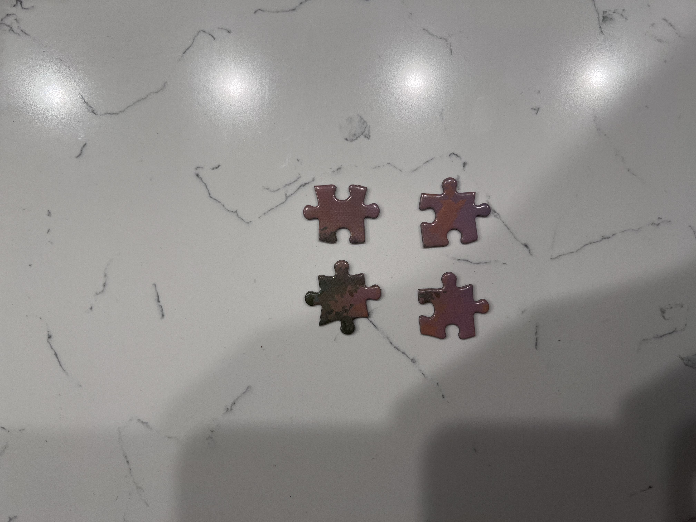

# Jigsaw Puzzle Solver

## How It Works
To use this program, you must have Python, OpenCV, and Numpy installed. 
Next, lay out the pieces of a jigsaw puzzle on a flat, clean surface where the pieces can pop out from the background, seen below:

</img>

After you have taken the picture, upload it into the `./Pieces` directory. The program will use the image in this directory to piece together the image.

Next, simply run the python script with `python contours.py` or `python3 contours.py`, and you are finished! 

## How the program works
The program itself utilizes the OpenCV library. It starts by creating a threshold that is applied in the next step, finding the contours of the image. We then can re-represent the contours using arc-length. Then, using the feature descriptors, we can match the pieces with eachother and output the matches through a backtracking algorithm.